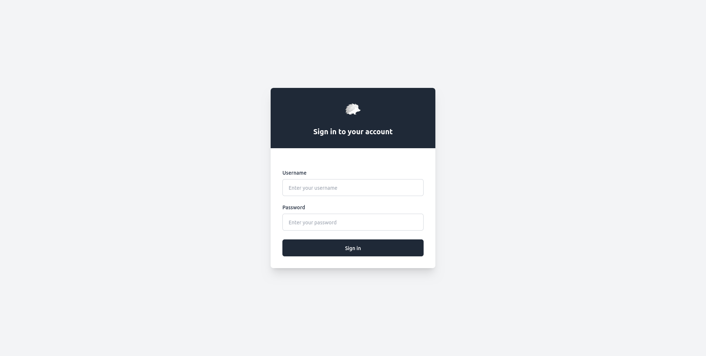
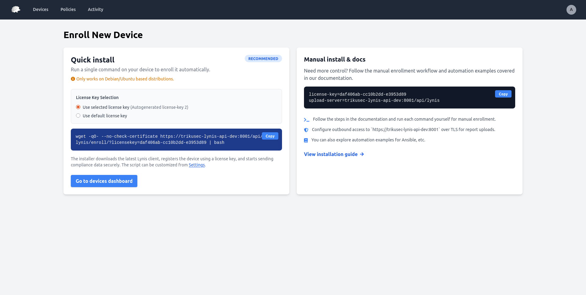
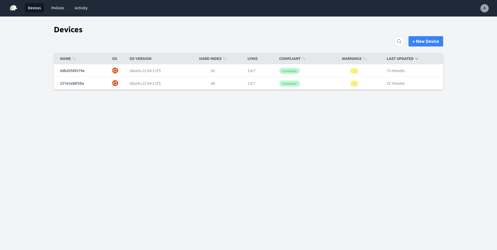

# Getting Started

This guide will help you get started with TrikuSec after installation.

## First Login

1. **Access TrikuSec** - Navigate to `https://localhost:8000` (or your configured domain)

2. **Login** - Use default credentials:
   - Username: `admin`
   - Password: `trikusec`

!!! warning "Change Default Password"
    Immediately change the default password after first login.

## Initial Setup

### 1. Change Admin Password

1. Click on your username in the top right
2. Select "Change Password"
3. Enter a strong password

### 2. Generate License Keys

License keys are required for clients to upload reports.

1. Navigate to the admin section
2. Create a new license key
3. Copy the license key for use in client configuration

### 3. Configure First Client

See [Client Setup](../installation/client-setup.md) for detailed instructions.

### 4. Review Default Baseline Ruleset

TrikuSec includes a **"Default baseline"** ruleset with essential security checks. You can:
- View it in **Policies** → **Rulesets**
- Assign it to devices for immediate compliance monitoring
- Use it as a starting point for custom policies

## Dashboard Overview

After logging in, you'll see the **Security Overview Dashboard** as the default landing page. The dashboard provides:

### Summary Cards
- **Total Devices** - Number of monitored servers
- **Compliance Rate** - Percentage of compliant devices with visual progress bar
- **Total Warnings** - Aggregated warning count across all devices
- **Average Hardening Index** - Mean security hardening score

### OS Distribution
Visual breakdown showing the distribution of operating systems and versions across your infrastructure.

### Top Security Issues
- **Most Common Warnings** - Top 5 warnings with affected device counts
- **Most Common Suggestions** - Top 5 recommendations across devices

### Recent Activity
Latest device events including enrollments, compliance changes, and other updates.

### Needs Attention
Table of non-compliant devices sorted by how long they've been non-compliant, helping you prioritize remediation efforts.

## Additional Views

### Devices
- **Devices** - List all servers that have sent reports
- **Device Details** - Detailed view of individual servers
- **Compliance Status** - Per-device compliance information
- **Warnings** - Security warnings and recommendations

### Policies
- **Rulesets** - Collections of compliance rules
- **Rules** - Individual security checks
- **Assignments** - Device-to-ruleset mappings

### Activity
- **Activity Feed** - Chronological view of all changes and events
- **Diff Reports** - Track what changed between audit runs

## Viewing Your First Report

Once a client has uploaded a report:

1. Navigate to **Devices** from the main menu
2. Click on a device to view details
3. Review the compliance status
4. Check warnings and suggestions

## Next Steps

- [Dashboard Guide](dashboard.md) - Detailed overview of dashboard features
- [Device Management](devices.md) - Learn about device management features
- [Policy Management](policies.md) - Create and manage policies
- [Report Analysis](reports.md) - Understand audit reports

